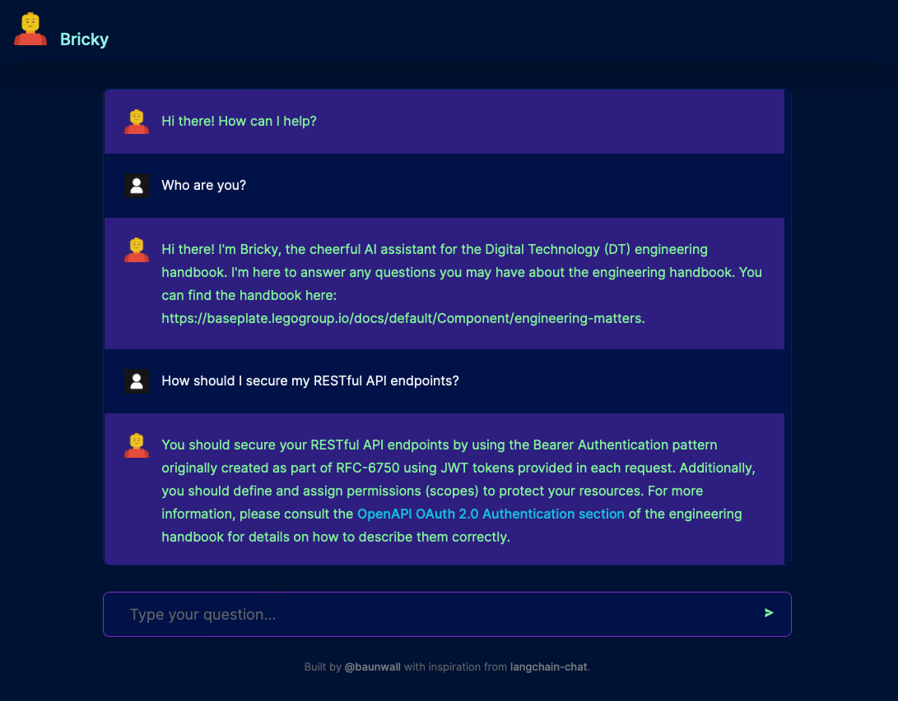

## Meet Bricky - a conversational bot (Haystack chatbot using OpenAI)




## Getting started 🚀

### Prereqs

Provide these `env` variables for the api container:

```
OPENAI_KEY=<YOUR OPENAI KEY GOES HERE>
DOC_DIR=<YOUR GLOB PATTERN FOR RECURSIVE DOC SEARCH HERE>
INDEX_NAME=faiss_index
```

Easiest way is to create a `dotenv` file in `/api/.env`

### Steps

1. Clone this repo!
2. Run docker-compose: `docker-compose up`

You should now have two endpoints running:

- The [Nextjs-based frontend](./app): Open [http://localhost:3000](http://localhost:3000) to meet Bricky.
- The [Haystack-based API](./api): Open [http://localhost:8080/docs](http://localhost:8080/docs) with your browser to see the OpenAPI documentation.

## Learn more

To learn more about Haystack and OpenAI, take a look at the following resources:

- [Haystack Documentation](https://docs.haystack.deepset.ai/docs) - learn about the Haystack platform by deepset.ai.
- [OpenAI docs](https://platform.openai.com/docs/introduction) - the OpenAI docs site.

To learn more about Next.js, take a look at the following resources:

- [Next.js Documentation](https://nextjs.org/docs) - learn about Next.js features and API.
- [Learn Next.js](https://nextjs.org/learn) - an interactive Next.js tutorial.

## Powered by haystack and OpenAI ChatGPT

- Frontend implementation can be found [here](./app).
- Backend implementation can be found [here](./api).

Questions or comments? Reach out to [@larsbaunwall](https://github.com/larsbaunwall)
Don't forget to :star: this repo!