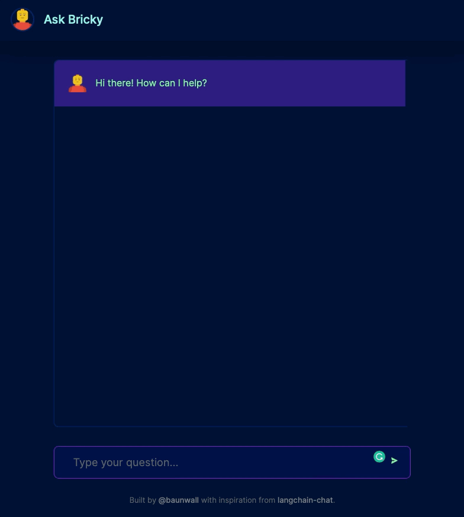

## Meet Bricky - a conversational bot using OpenAI 🤖

Remember clippy? Meet bricky!

Bricky is a conversational bot using [Retrieval-Augmented Generation](https://arxiv.org/abs/2005.11401) with some help from OpenAI's GPT-3 LLM.

Bricky indexes content stored in markdown files and vectorizes it using OpenAI embeddings. It then uses few-shot learning using a ChatGPT prompt to generate an answer based on relevant content. 

Read more about my journey into this field and the background for creating Bricky in [my blog article](https://medium.com/@larslb/standing-on-the-shoulders-of-a-giant-embedding-intelligent-behavior-using-large-language-models-8c0f644b6d87)

The project is inspired by the awesome [HoustonAI by Astro](https://github.com/withastro/houston.astro.build)




## Getting started 🚀

### Prereqs

Provide these `env` variables for the api container by creating a `dotenv` file in `api/.env`

```
OPENAI_KEY=<YOUR OPENAI KEY GOES HERE>
```

### Steps

1. Clone this repo!
1. Copy over your documentation to `api/sources`
1. Run docker-compose: `docker-compose up`

You should now have two endpoints running:

- The [Nextjs-based frontend](./app): Open [http://localhost:3000](http://localhost:3000) to meet Bricky.
- The [Haystack-based API](./api): Open [http://localhost:8080/docs](http://localhost:8080/docs) with your browser to see the OpenAPI documentation.

Note: if you make changes to the any files, i.e. `api/.env` or the docs in `sources/docs`, you need to rebuild the images: `docker-compose rebuild --no-cache`.

## Learn more

To learn more about Haystack and OpenAI, take a look at the following resources:

- [Haystack Documentation](https://docs.haystack.deepset.ai/docs) - learn about the Haystack platform by deepset.ai.
- [OpenAI docs](https://platform.openai.com/docs/introduction) - the OpenAI docs site.

To learn more about Next.js, take a look at the following resources:

- [Next.js Documentation](https://nextjs.org/docs) - learn about Next.js features and API.
- [Learn Next.js](https://nextjs.org/learn) - an interactive Next.js tutorial.

## Powered by haystack and OpenAI ChatGPT

- Frontend implementation can be found [here](./app).
- Backend implementation can be found [here](./api).

Questions or comments? Reach out to [@larsbaunwall](https://github.com/larsbaunwall)

Don't forget to :star: this repo!
